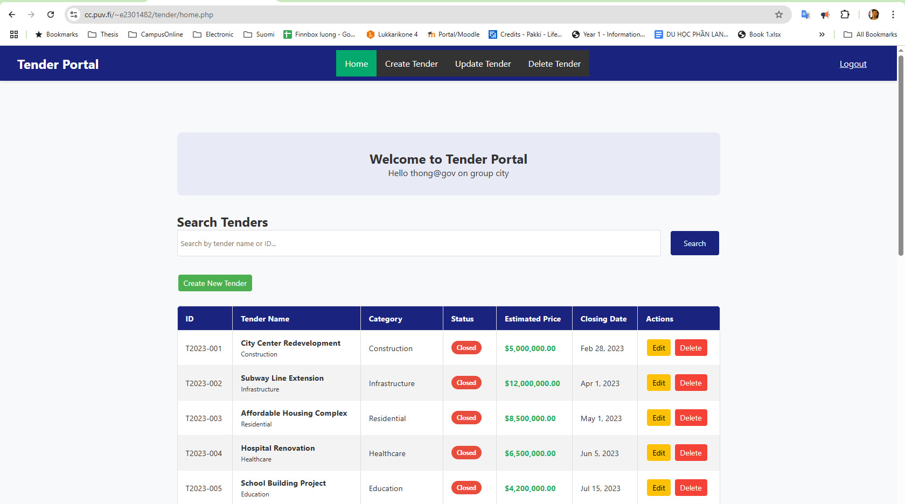

# Agile Project - Online Tender
## Demo: [www](https://www.cc.puv.fi/~e2301482/tender/index.html)

## Bastractor 
I'm still working on it. This project is a chance for full stack studying. I practice designing and programming for both frontend and back-end. That is a linking of Javascript, PHP API, MySQL, and web mockup HTML+CSS. I don't use any framework, just coding basics so that I can understand better about logic and also syntax grammar. Of course, I made so much mistate and a lot of time to fix that! :-))
